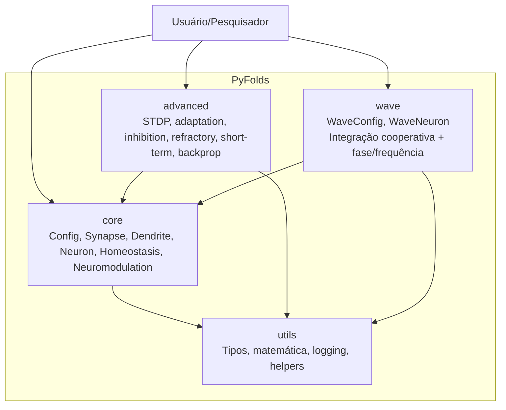
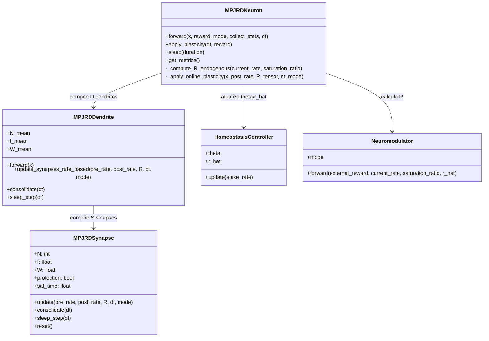

# ARCHITECTURE — PyFolds (C4 + Runtime Sequence)

Este documento descreve a arquitetura do PyFolds usando a abordagem C4 e um diagrama de sequência do `forward`.

## 1. C4 — Contexto (C1)

```mermaid
flowchart LR
    U[Pesquisador / Engenheiro de ML]
    P[PyFolds\nMPJRD v2 + MPJRD-Wave v3]
    T[PyTorch\nTensores / Autograd / Device]

    U -->|Configura experimento, treina, analisa métricas| P
    P -->|Executa operações tensorizadas| T
    T -->|Backend numérico (CPU/GPU)| P
```

**Escopo do sistema:** modelagem neural bioinspirada com sinapse estrutural, processamento dendrítico, homeostase, neuromodulação e extensões de fase/frequência.

---

## 2. C4 — Containers (C2)



---

## 3. C4 — Componentes do módulo `core` (C3)



---

## 4. Diagrama de sequência — `forward_pass`

```mermaid
sequenceDiagram
    participant Client as Treinador/Loop
    participant Neuron as MPJRDNeuron
    participant D as MPJRDDendrite[*]
    participant Syn as MPJRDSynapse[*]
    participant H as HomeostasisController
    participant N as Neuromodulator

    Client->>Neuron: forward(x, reward, mode)
    loop para cada dendrito d
      Neuron->>D: forward(x[:, d, :])
      D->>Syn: consulta W (derivado de N)
      Syn-->>D: contribuição sináptica
      D-->>Neuron: v_dend[:, d]
    end

    Neuron->>Neuron: gating/integração (WTA ou cooperativo)
    Neuron->>Neuron: u = soma(v_dend_processado)
    Neuron->>Neuron: spikes = 1[u >= theta]

    alt modo != inference
      Neuron->>H: update(spike_rate)
      H-->>Neuron: theta, r_hat atualizados
    end

    Neuron->>N: forward(reward, spike_rate, saturation_ratio, r_hat)
    N-->>Neuron: R

    opt batch com defer_updates
      Neuron->>Neuron: stats_acc.accumulate(x, gated, spikes)
    end

    Client<<--Neuron: {spikes, u, v_dend, theta, r_hat, R, ...}
```

---

## 5. Decisões arquiteturais

- **Interpretabilidade por estado:** sinapse mantém `N` e `I` explícitos.
- **Separação de escalas temporais:** aquisição online e consolidação/sleep offline.
- **Extensibilidade:** v3.0 reutiliza o core e estende inferência com fase/frequência.
- **Compatibilidade com PyTorch:** módulos `nn.Module`, buffers registrados e operações vetorizadas.
