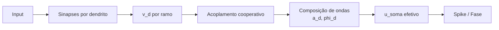

# Scientific Logic — PyFolds v2.0/v3.0

## Objetivo científico

Este documento descreve **por que** o PyFolds funciona do ponto de vista neurocomputacional, e não apenas como usar a API. A proposta central é reduzir a opacidade de redes tradicionais por meio de estados mecanísticos observáveis, com mapeamento explícito entre estrutura e função.

---

## 1) Fundamentação: Computação Dendrítica Não-Linear

A literatura experimental e teórica sugere que neurônios biológicos não são somadores lineares simples:

- **Mel (1992, 1994)**: dendritos como subunidades computacionais não-lineares.
- **Gidon et al. (2020)**: evidência de computação sofisticada em dendritos humanos.
- **Bartol et al. (2015)**: precisão/sinalização sináptica em nanoescala, compatível com quantização estrutural.

### Tese operacional do PyFolds

1. **Sinapse como estado** (não apenas peso):
   - `N`: filamentos discretos (memória estrutural);
   - `I`: potencial interno (componente volátil);
   - `W = log2(1+N)/w_scale` (peso derivado, monotônico, interpretável).
2. **Dendrito como subunidade**:
   - integração local de sinapses,
   - resposta não-linear por ramo.
3. **Soma como decisor**:
   - integra saídas dendríticas,
   - define disparo (`spike`) de forma auditável.
4. **Axônio/onda-fase como saída funcional**:
   - codificação por presença de spike e, na versão Wave, por fase/interferência.

---

## 2) Quantização de filamentos (N) e interpretabilidade

Em redes densas clássicas, um peso contínuo isolado tem baixa semântica causal para humanos. No PyFolds, `N` é discreto e limitado (`n_min ≤ N ≤ n_max`), oferecendo:

- **trilhas de auditoria** (promoção/rebaixamento de estado),
- **estabilidade** contra microflutuações,
- **ligação direta com capacidade sináptica**.

### Regra estrutural simplificada

\[
W(N) = \frac{\log_2(1+N)}{w_{scale}}
\]

\[
\Delta I \propto \eta \cdot R \cdot (pre \cdot post) \cdot (1 + \beta_w W) \cdot dt
\]

Com limiares:

- se `I ≥ θ_LTP` → `N ← N+1` (até `n_max`),
- se `I ≤ θ_LTD` → `N ← N-1` (até `n_min`).

Essa dinâmica converte sinais de curto prazo em memória estrutural discreta (longo prazo), reduzindo a “caixa preta” porque cada transição de estado é rastreável.

---

## 3) Da competição dura (Hard-WTA) à Integração Cooperativa

### Limite da abordagem Hard-WTA

No mecanismo winner-take-all estrito, apenas um dendrito domina a decisão por passo. Isso favorece separação forte, mas pode:

- descartar evidência complementar de outros ramos;
- reduzir robustez em padrões compostos;
- dificultar explicações multicausais.

### Introdução da Integração Cooperativa (v2/v3)

A proposta de evolução substitui seleção dura por um acoplamento suave entre ramos:

\[
\alpha_d = \frac{\exp(v_d/\tau)}{\sum_j \exp(v_j/\tau)}
\]

\[
u_{soma} = \sum_d \alpha_d \cdot v_d
\]

Com isso, múltiplos dendritos contribuem proporcionalmente. Resultado: melhor retenção de contexto e explicações mais fiéis ao padrão de entrada.

---

## 4) Lógica de interferência de ondas (Wave Version)

A versão Wave estende a saída binária para um regime de fase:

\[
z_d = a_d e^{i\phi_d}
\]

\[
z_{soma} = \sum_d z_d
\]

\[
a_{eff} = |z_{soma}|,
\quad
\phi_{eff} = \arg(z_{soma})
\]

A interferência construtiva/destrutiva modela sinergia ou conflito entre dendritos, preservando informações que seriam perdidas em agregações escalares simples.

---

## 5) Como isso enfrenta o problema da "Caixa Preta"

| Problema em MLP tradicional | Mecanismo no PyFolds | Ganho de explicabilidade |
|---|---|---|
| Pesos internos sem semântica local | Estado sináptico (`N`, `I`, `W`) | Trajetória causal por sinapse |
| Ativações ocultas agregadas sem estrutura | Dendritos explícitos (`v_dend`) | Atribuição por subunidade |
| Decisão final sem decomposição biológica | Soma com limiar homeostático (`theta`) | Decisão auditável por estado |
| Aprendizado monolítico | Online + consolidação offline | Separação aquisição vs estabilização |

---

## 6) Estrutura sugerida para próximos documentos

- `ARCHITECTURE.md`: mapeamento C4 (Container/Component) do pipeline Sinapse→Dendrito→Soma→Axônio.
- `ALGORITHM.md`: derivação completa do forward, plasticidade e sono.
- `API_REFERENCE.md`: contrato formal de `MPJRDNeuron`, `MPJRDDendrite`, `StatisticsAccumulator`.

---

## Referências-chave

- Bartol, T. M. et al. (2015). *Nanoconnectomic upper bound on the variability of synaptic plasticity*.
- Mel, B. W. (1992, 1994). *Dendritic computation and NMDA-based pattern discrimination*.
- Gidon, A. et al. (2020). *Dendritic action potentials and computation in human layer 2/3 cortical neurons*.
