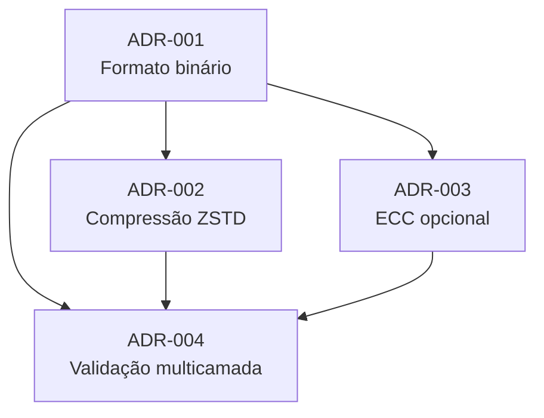
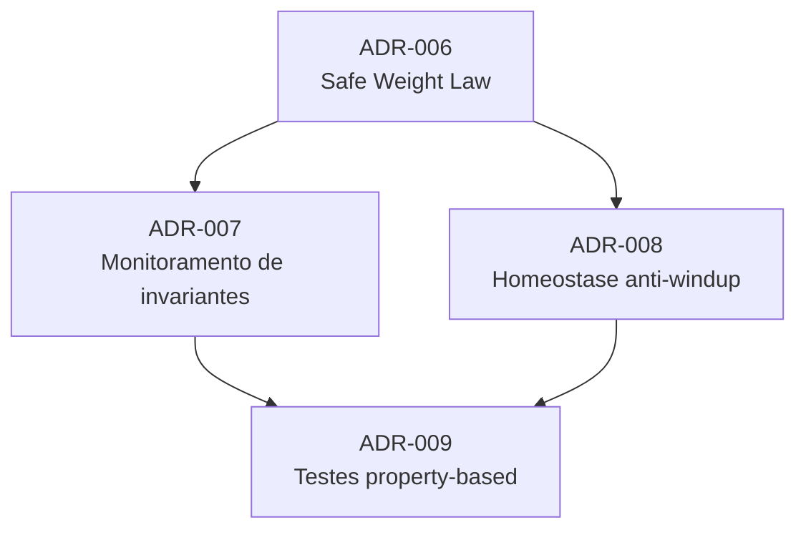

# ADR Index — Architecture Decision Records

Este índice organiza as decisões de arquitetura e suas dependências.

## Núcleo de serialização `.fold/.mind`

1. [ADR-001 — Formato binário `.fold/.mind` com índice no trailer](./ADR-001-formato-binario-fold-mind.md)
2. [ADR-002 — Compressão ZSTD por chunk](./ADR-002-compressao-zstd-por-chunk.md)
3. [ADR-003 — ECC opcional por chunk](./ADR-003-ecc-opcional-por-chunk.md)
4. [ADR-004 — Validação multicamada para leitura segura](./ADR-004-validacao-multicamada.md)

### Mapa de dependências (serialização)

## Trilha matemática e estabilidade numérica

6. [ADR-006 — Safe Weight Law](./ADR-006-safe-weight-law.md)
7. [ADR-007 — Monitoramento de invariantes](./ADR-007-monitoramento-de-invariantes.md)
8. [ADR-008 — Homeostase com anti-windup](./ADR-008-homeostase-com-anti-windup.md)
9. [ADR-009 — Testes de propriedades matemáticas](./ADR-009-testes-de-propriedades-matematicas.md)

### Mapa de dependências (matemática)

## Links cruzados úteis
- Especificação binária detalhada: [docs/FOLD_SPECIFICATION.md](../FOLD_SPECIFICATION.md)
- Documento de formato teórico prévio: [docs/theory/FOLD_MIND_FORMAT.md](../theory/FOLD_MIND_FORMAT.md)
- ADR legado relacionado ao container: [docs/developments/adr/ADR-0002-fold-mind-container.md](../developments/adr/ADR-0002-fold-mind-container.md)
