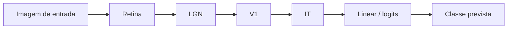

# Análise passo a passo da arquitetura FOLDSNet

Este documento consolida uma leitura prática da topologia da rede para treino em MNIST/CIFAR, com foco em:

- organização por camadas (input → retina → lgn → v1 → it → classificador),
- crescimento de capacidade por variante (`2L`, `4L`, `5L`, `6L`),
- relação entre número de neurônios, parâmetros e memória,
- interpretação dos mecanismos de memória/engram/EEG no contexto do projeto.

## 1) Fluxo da inferência



No código, esse fluxo está implementado no `forward` de `FOLDSNet`.

## 2) Como a topologia cresce

A base é calculada por pixels da entrada (`n_pixels // 16`) e escalada por multiplicador da variante.

- `2L`: 0.2
- `4L`: 1.0
- `5L`: 1.3
- `6L`: 1.7

Após isso:

- `retina = n_retina`
- `lgn = n_retina`
- `v1 = 2 * n_retina`
- `it = n_retina`

Isso implica crescimento quase linear da capacidade neuronal total com a variante.

## 3) Memória e parâmetros

No FOLDSNet atual, o bloco com parâmetros explícitos mais evidente é o classificador `nn.Linear(n_it, n_classes)`.

- pesos = `n_it * n_classes`
- bias = `n_classes`
- params totais = `n_it * n_classes + n_classes`

Para comparar combinações dataset/variante, use o relatório gerado em:

- `docs/assets/FOLDSNET_ARCHITECTURE_REPORT.md`
- `docs/assets/foldsnet_architecture_report.json`

## 4) Engram, EEG e memória no projeto

- O FOLDSNet usa dinâmica bioinspirada via neurônios/camadas internas.
- Mecanismos como engram e sinais ligados a processos de memória/consolidação aparecem de forma mais direta na trilha MPJRD avançada e seus toggles de treino.
- Portanto, para experimentos fortemente orientados a memória/consolidação, a comparação FOLDSNet vs MPJRD é recomendada.

## 5) Script reprodutível

Para regenerar análise de arquitetura:

```bash
python scripts/analyze_foldsnet_architecture.py
```

Saídas:

- `docs/assets/foldsnet_architecture_report.json`
- `docs/assets/FOLDSNET_ARCHITECTURE_REPORT.md`

## 6) Leitura prática para ajuste (treino)

1. Comece com `4L` em MNIST para baseline.
2. Se acurácia estacionar, testar:
   - mais épocas,
   - ajuste de LR,
   - `5L`/`6L` se houver budget computacional.
3. Em CIFAR100, considere variante maior por maior número de classes.
4. Sempre comparar `best_acc` e não só `final_acc`.
