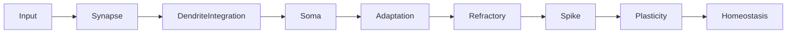

# Real Pipeline (estado atual)

Diagrama canônico do pipeline de execução do neurônio no estado atual do projeto.

> Fonte de verdade para fluxo principal: este documento substitui fluxos legados centrados em WTA hard como caminho principal.
