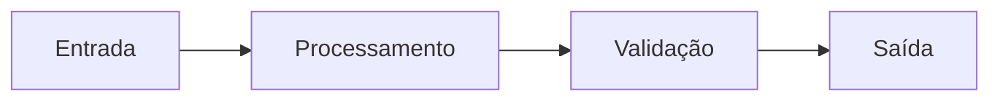
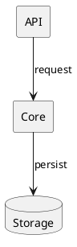
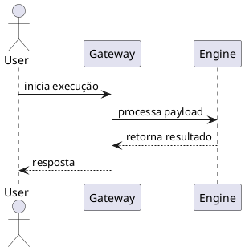

# STYLE GUIDE — Diagramas IEEE-like

## Objetivo
Padronizar diagramas para documentação técnica com legibilidade, rastreabilidade e auditabilidade.

## Escopo
Diagramas de processo, componentes e sequência em MyST + Mermaid/PlantUML.

## Definições/Termos
- **Semântica visual:** significado de cores, bordas e ícones.
- **Legenda:** bloco obrigatório de interpretação.

## Conteúdo técnico

### Convenções visuais
1. **Cor não é semântica única.** Toda categoria deve ter redundância por texto, borda, padrão ou ícone.
2. **Legenda obrigatória** em todos os diagramas técnicos.
3. **Compatibilidade P&B:** conteúdo deve permanecer interpretável em escala de cinza.
4. **Acessibilidade:** contraste mínimo adequado e rótulos textuais explícitos.

### Paleta recomendada (PyFolds)
- Azul primário: `#0f4c81` (componentes principais)
- Amarelo destaque: `#f2c94c` (alertas/destaques)
- Cinza neutro: `#6b7280` (contexto/apoio)

### Template — Processo (Mermaid)

### Template — Componentes (UML)

### Template — Sequência (UML)

### Diagramas gerados (pipeline GitHub Pages)
Quando o pipeline UML publicar imagens renderizadas, referencie e/ou incorpore os artefatos nesta seção.

- Exemplo local de imagem gerada: [Arquitetura de neurônio](../../assets/neuron_architecture.png)
- Exemplo local de imagem gerada: [Topologia de rede](../../assets/network_topology.png)

## Referências
- [Processo](processo.md)
- [Componentes](componentes.md)
- [Sequência](sequencia.md)
