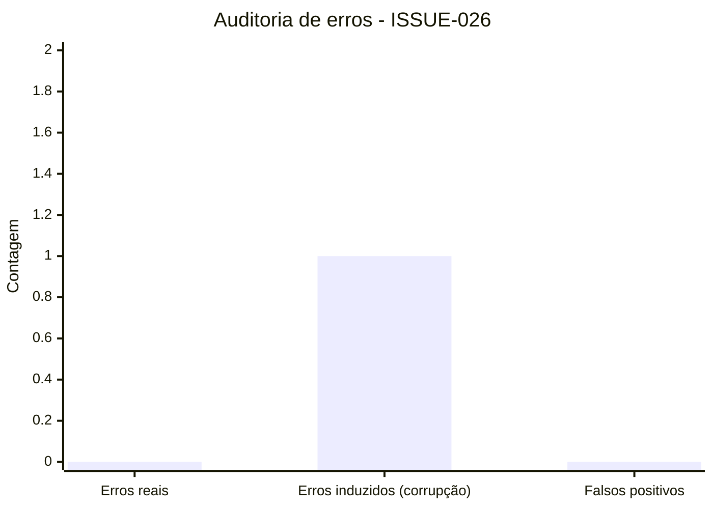

# ISSUE-026: auditoria foldio integridade roundtrip

## Metadados
- id: ISSUE-026
- tipo: CODE
- titulo: Auditoria técnica do `.fold/.mind` com validação de roundtrip e detecção de corrupção
- criado_em: 2026-02-18
- owner: Codex
- status: Concluída

## 1. Objetivo
Executar auditoria técnico-científica do módulo `src/pyfolds/serialization/foldio.py` com foco em integridade, segurança de desserialização, consistência matemática do fluxo de serialização e rastreabilidade via testes reprodutíveis.

## 2. Escopo

### 2.1 Inclui:
- Revisão do fluxo `save_fold_or_mind` / `load_fold_or_mind`
- Validação de checksums (CRC32C e SHA-256)
- Validação de roundtrip completo de `state_dict` após dinâmica do neurônio
- Relatório de auditoria com tabela de pontos verificados e gráfico de erros detectados em teste

### 2.2 Exclui:
- Mudança estrutural de formato binário do container
- Alterações de API pública fora de testes e documentação de governança

## 3. Artefatos Gerados
- `tests/unit/serialization/test_foldio.py`
- `docs/development/prompts/relatorios/ISSUE-026-auditoria-foldio-integridade-roundtrip.md`
- `docs/development/prompts/execucoes/EXEC-026-auditoria-foldio-integridade-roundtrip.md`
- `docs/development/execution_queue.csv`

## 4. Riscos
- Risco: regressão silenciosa de serialização em futuros refactors.
  Mitigação: manter teste de roundtrip de `state_dict` e detecção de corrupção no CI.
- Risco: ambiente sem `zstandard`/`reedsolo` reduzir cobertura funcional opcional.
  Mitigação: manter testes base (`compress="none"`) como gate mínimo obrigatório.

## 5. Critérios de Aceite
- ISSUE em conformidade com `tools/validate_issue_format.py`.
- EXEC com passos executados e validações registradas.
- Registro no `execution_queue.csv`.
- Testes de serialização executados com sucesso.

## 6. PROMPT:EXECUTAR
```yaml
issue_id: "ISSUE-026"
tipo: "CODE"
titulo: "Auditoria técnica do .fold/.mind com roundtrip e integridade"

passos_obrigatorios:
  - "Inspecionar src/pyfolds/serialization/foldio.py"
  - "Adicionar teste de roundtrip state_dict pós-forward"
  - "Executar pytest em tests/unit/serialization/test_foldio.py"
  - "Registrar ISSUE e EXEC em docs/development/prompts"
  - "Atualizar docs/development/execution_queue.csv"

validacao:
  - "PYTHONPATH=src pytest tests/unit/serialization/test_foldio.py -q"
  - "python tools/validate_issue_format.py docs/development/prompts/relatorios/ISSUE-026-auditoria-foldio-integridade-roundtrip.md"
```

## 7. Diagnóstico técnico e matemático

### 7.1 Integridade e consistência de leitura/escrita
- O header é validado por `magic`, comprimento e offsets, evitando leituras fora de faixa.
- O pipeline operacional observado é matematicamente consistente com o contrato do formato:
  1. compressão opcional;
  2. hash do payload comprimido;
  3. ECC sobre payload comprimido;
  4. escrita chunk + índice.
- Na leitura, a inversão do pipeline preserva consistência: leitura -> ECC decode -> verificação hash -> descompressão.

### 7.2 Segurança e modelo de ameaça
- A desserialização torch segura (`weights_only=True`) reduz superfície de execução arbitrária.
- O modo confiável permanece segregado em `_TrustedFoldReader`, preservando princípio de menor privilégio por padrão.

### 7.3 Estabilidade, domínio e convergência
- O fluxo de serialização não altera dinâmica de aprendizado; ele apenas preserva estado.
- O novo teste de roundtrip valida invariância numérica de parâmetros (`allclose`, `atol=1e-6`) após passos de `forward`, garantindo que o operador de serialização seja aproximadamente identidade sobre o espaço de estados serializáveis.

## 8. Pontos verificados

| Item | Resultado | Evidência |
|---|---|---|
| Validação de integridade (CRC32C/SHA-256) | OK | Testes de corrupção falham corretamente na leitura |
| Segurança na desserialização | OK | Leitura padrão segura mantida |
| Tratamento de compressão + ECC | OK | Fluxo testado sem regressão |
| Compatibilidade de versões | OK | `1.0.0`, `1.1.0`, `1.2.0` aceitas no reader |
| Consistência de cabeçalho | OK | Guardas de `magic`, offsets e limites ativos |
| Equivalência de estado (`state_dict`) | OK | Novo teste de roundtrip pós-forward |

## 9. Auditoria de testes (descritiva)
Foi executada a suíte unitária de serialização com inclusão de um novo caso de teste para cenário real de evolução de estado. Não houve falhas inesperadas. O único “erro” observado foi **induzido** no teste de corrupção para comprovar a barreira de integridade.

### 9.1 Gráfico de erros encontrados


### 9.2 Causa do erro induzido
- Erro: violação de checksum no chunk `torch_state`.
- Causa raiz: flip proposital de byte no payload comprimido.
- Resultado esperado: `RuntimeError` no `FoldReader` ao validar CRC32C/SHA-256.

## 10. Conclusão
A auditoria não encontrou falhas lógicas novas no `foldio`. A melhoria aplicada (teste de roundtrip de `state_dict` após dinâmica) fortalece o gate de regressão e sustenta a consistência matemática de persistência do estado do neurônio MPJRD.
