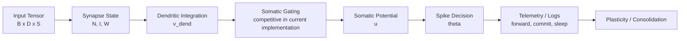

# PyFolds Documentation Index

> **Document Status:** Stable  
> **Audience:** Researchers, ML Engineers, Systems Engineers  
> **Standard Orientation:** IEEE-style technical documentation (structured, traceable, reproducible)

---

## Abstract

This documentation set defines the technical and scientific baseline for **PyFolds v2.0/v3.0**, a bio-inspired neural computation framework centered on the **MPJRD (Multi-Pathway Joint-Resource Dendritic)** model. The goal is to provide both operational guidance (*how to use*) and mechanistic rationale (*why it works*), with explicit traceability from architecture to API and runtime behavior.

---

## 1. Purpose and Scope

### 1.1 Purpose

This index is the canonical entry point for project documentation. It organizes content to support:

- onboarding and setup,
- architecture and design understanding,
- API-level implementation and integration,
- scientific interpretation of model behavior.

### 1.2 Scope

The documentation covers:

- core MPJRD computation pipeline,
- advanced mechanisms (STDP, adaptation, inhibition, refractory, short-term dynamics),
- telemetry/observability surfaces,
- scientific logic and theoretical references.

---

## 2. Document Architecture (C4-Aligned)

PyFolds documentation is structured in layers, aligned with C4 communication practices:

- **Level 1 — Context:** PyFolds in research/engineering workflows.
- **Level 2 — Containers:** `core`, `advanced`, `layers`, `network`, `telemetry`, `utils`.
- **Level 3 — Components:** Synapse → Dendrite → Soma → Axon.
- **Level 4 — Code:** classes, methods, data contracts, runtime outputs.

```mermaid
flowchart LR
    A[Context\nResearch / Engineering] --> B[Containers\ncore | advanced | layers | network | telemetry | utils]
    B --> C[Components\nSynapse -> Dendrite -> Soma -> Axon]
    C --> D[Code\nClasses | Methods | Contracts]
```

---

## 3. Runtime Processing View

The operational flow below emphasizes traceability and observability of model decisions.



---

## 4. Recommended Reading Sequence

For efficient onboarding and technical depth progression:

1. [`installation.md`](installation.md)
2. [`quickstart.md`](quickstart.md)
3. [`guide/core_concepts.md`](guide/core_concepts.md)
4. [`guide/neuron_architecture.md`](guide/neuron_architecture.md)
5. [`api/core.md`](api/core.md)
6. [`SCIENTIFIC_LOGIC.md`](SCIENTIFIC_LOGIC.md)

---

## 5. Documentation Map

### 5.1 Getting Started

- [`installation.md`](installation.md)
- [`quickstart.md`](quickstart.md)

### 5.2 Guides (Conceptual and Operational)

- [`guide/core_concepts.md`](guide/core_concepts.md)
- [`guide/neuron_architecture.md`](guide/neuron_architecture.md)
- [`guide/engineering_patterns.md`](guide/engineering_patterns.md)
- [`guide/plasticity.md`](guide/plasticity.md)
- [`guide/homeostasis.md`](guide/homeostasis.md)
- [`guide/neuromodulation.md`](guide/neuromodulation.md)
- [`guide/advanced_mechanisms.md`](guide/advanced_mechanisms.md)
- [`guide/telemetry.md`](guide/telemetry.md)
- [`guide/logging.md`](guide/logging.md)

### 5.3 API Reference

- [`api/core.md`](api/core.md)
- [`api/network.md`](api/network.md)
- [`api/layers.md`](api/layers.md)
- [`api/advanced.md`](api/advanced.md)
- [`api/utils.md`](api/utils.md)
- [`api/telemetry.md`](api/telemetry.md)

### 5.4 Theory and Scientific Logic

- [`SCIENTIFIC_LOGIC.md`](SCIENTIFIC_LOGIC.md)
- [`theory/mpjrd_model.md`](theory/mpjrd_model.md)
- [`theory/three_factor_learning.md`](theory/three_factor_learning.md)
- [`theory/two_factor_consolidation.md`](theory/two_factor_consolidation.md)
- [`theory/stdp_mechanism.md`](theory/stdp_mechanism.md)

---

## 6. Traceability Matrix (Design → Artifact)

| Design Concern | Primary Artifact | Verification Surface |
|---|---|---|
| Engenharia operacional (Factory/Validation/Checkpoint/Health) | `guide/engineering_patterns.md` | testes unitários + contratos de uso |
| Core neuron pipeline | `guide/neuron_architecture.md`, `api/core/neuron.md` | forward outputs (`u`, `v_dend`, `spikes`) |
| Structural plasticity (`N`, `I`, `W`) | `guide/plasticity.md`, `api/core/synapse.md` | state transitions and thresholds |
| Homeostatic stability | `guide/homeostasis.md`, `api/core/homeostasis.md` | `theta`, `r_hat`, target rate dynamics |
| Neuromodulatory control | `guide/neuromodulation.md`, `api/core/neuromodulation.md` | `R` behavior across modes |
| Batch/sleep consolidation | `api/core/accumulator.md`, theory docs | commit/sleep phase outputs |
| Observability and auditability | `guide/telemetry.md`, `api/telemetry.md` | event stream and sink outputs |

---

## 7. Documentation Quality Principles

This documentation follows engineering-oriented principles:

- **Consistency:** terminology and naming aligned with source code.
- **Scannability:** tables, section numbering, and concise subsections.
- **Reproducibility:** runnable examples and explicit mode semantics.
- **Traceability:** each conceptual statement maps to concrete artifacts.
- **Non-ambiguity:** explicit distinction between current behavior and roadmap.

---

## 8. Versioning Note

This index is maintained for the `v2.0/v3.0` documentation track. Behavioral details marked as roadmap should not be interpreted as current runtime guarantees unless explicitly implemented in code.
