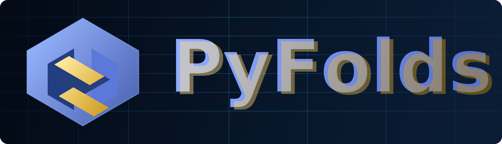

# PyFolds Documentation



Documentação técnica estruturada para uso, desenvolvimento, API e governança do PyFolds.

## Objetivo
Estabelecer uma base documental estável, navegável e consistente com padrões técnicos IEEE-like.

## Escopo
- Guias de usuário (instalação, quickstart, exemplos).
- Guias de desenvolvimento (contribuição, testes, empacotamento, diagramas).
- Estratégia de documentação de API.
- Governança (ADRs e políticas de qualidade).
- **Hub interno existente:** `docs/development/HUB_CONTROLE.md` (não recriar do zero; apenas evoluir).

## Definições/Termos
- **IEEE-like:** estilo técnico com seções formais, rastreabilidade e linguagem objetiva.
- **ADR:** *Architecture Decision Record*.
- **MyST:** sintaxe Markdown estendida para Sphinx.

## Conteúdo técnico

```{raw} html
<div class="pyfolds-hero">
  
  <p class="pyfolds-hero-subtitle">Framework neural com identidade visual técnica, dinâmica e orientada a engenharia.</p>
</div>
```

```{toctree}
:maxdepth: 2
:caption: Navegação principal

user/index
development/index
api/index
governance/index
```

## Mapa do Código

Atualizado automaticamente pelo Sheer Audit no merge para `main`.

<!-- SHEER-CODEMAP:START -->
- Repositório: `pyfolds`
- Arquivos Python: `135`
- Símbolos: `963`


- Arquivo: `src/pyfolds/__init__.py`
- Imports:
  - `mod:src.advanced`
  - `mod:src.core.base`
  - `mod:src.core.config`
  - `mod:src.core.factory`
  - `mod:src.core.neuron`
  - `mod:src.core.neuron_v2`
  - `mod:src.layers`
  - `mod:src.monitoring`
  - `mod:src.network`
  - `mod:src.serialization`
  - `mod:src.telemetry`
  - `mod:src.utils.context`
  - `mod:src.utils.types`
  - `mod:src.wave`
  - `mod:typing`
  - `mod:warnings`
- Funções:
  - `__getattr__(name)`

- Arquivo: `src/pyfolds/advanced/__init__.py`
- Imports:
  - `mod:logging`
  - `mod:src.core.neuron`
  - `mod:src.layers.layer`
  - `mod:src.pyfolds.adaptation`
  - `mod:src.pyfolds.backprop`
  - `mod:src.pyfolds.inhibition`
  - `mod:src.pyfolds.refractory`
  - `mod:src.pyfolds.short_term`
  - `mod:src.pyfolds.stdp`
  - `mod:src.utils.logging`
  - `mod:src.wave`
<!-- SHEER-CODEMAP:END -->

Consulte também: `docs/sheer-audit/sheerdocs/code_map.md`.

## Referências
- [README da documentação](README.md)
- [Portal interno de prompts](development/prompts.md)
