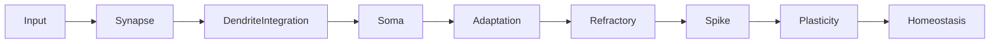

# Guide — Neuron Architecture

## Pipeline atual

```mermaid
flowchart LR
    Input --> Synapse --> DendriteIntegration --> Soma --> Adaptation --> Refractory --> Spike --> Plasticity --> Homeostasis
```

## Nota de evolução

O fluxo principal documentado deixou de usar WTA hard como caminho canônico. Para rastreabilidade histórica, o diagrama legado foi mantido como arquivo de referência em `docs/architecture/blueprints/sources/dendritic_processing_flow.mmd`.
