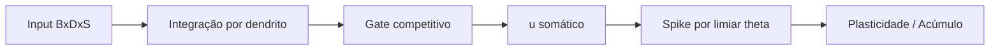

# Guide — Neuron Architecture

## Pipeline atual

## Nota de evolução

A base atual usa gate competitivo tipo WTA no `forward`. A trilha v2/v3 discute evolução para integração cooperativa como roadmap arquitetural.
