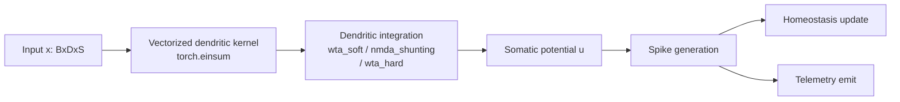
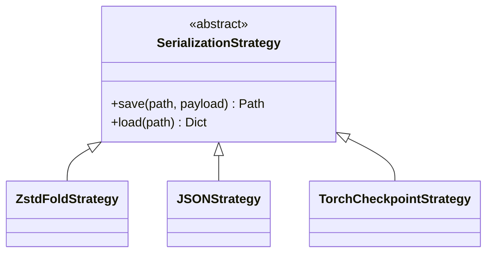
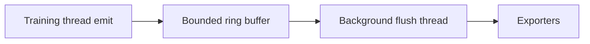

# Refactor Report

## Improvements made

- Added vectorized dendritic compute in `MPJRDNeuron` using `torch.einsum` with compatibility fallback (`use_vectorized_dendrites`).
- Added Strategy Pattern for serialization:
  - `SerializationStrategy` (abstract)
  - `ZstdFoldStrategy`
  - `JSONStrategy`
  - `TorchCheckpointStrategy`
- Added low-overhead telemetry implementation (`LowOverheadMetricsCollector`) with:
  - ring buffer (`collections.deque` bounded)
  - background flush thread
  - reduced lock scope for emit/flush
- Added property-based neuron tests with Hypothesis:
  - spike output binary/range invariant
  - finite membrane/dendrite potential invariant
  - deterministic inference with fixed seed
- Added benchmark regression gate (`benchmarks/regression_detector.py`) with CI failure threshold (>15% drop).
- Hardened CI matrix for Python 3.9-3.12 and PyTorch 2.0-2.3, including `ruff`, strict mypy targets, pytest coverage threshold.

## Performance changes

### Expected impact
- **Forward pass**: reduced Python overhead from per-dendrite dispatch into single vectorized `einsum` kernel over `[B,D,S]` x `[D,S]`.
- **Telemetry**: reduced training-thread contention by keeping critical section small and moving exporter work to background thread.

### Validation methodology
- Added benchmark regression detector to compare latest throughput against moving average of previous five runs.
- CI fails when drop > 15%.

## Architecture diagrams

### Neuron execution path

### Serialization strategy layer

### Low-overhead telemetry

