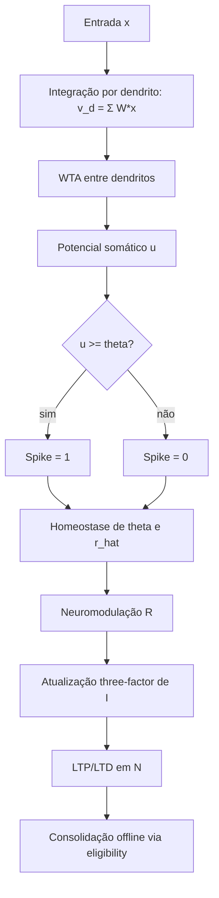

# MPJRD no PyFolds: artigo técnico de fundamentação teórica

## Resumo

Este documento consolida a teoria usada no PyFolds e faz o mapeamento direto para o código-fonte. O modelo MPJRD combina: (i) **quantização sináptica**, (ii) **integração dendrítica**, (iii) **disparo somático com competição entre dendritos**, (iv) **plasticidade de três fatores** e (v) **consolidação de dois fatores**.

A ideia central é representar cada sinapse com um estado estrutural discreto (`N`) e um estado volátil (`I`), permitindo aprendizado online e consolidação offline biologicamente inspirada.

---

## 1) Hipóteses científicas adotadas

1. **Sinapses com estados discretos funcionais** (inspiração em Bartol et al., 2015):
   - o estado estrutural é um inteiro limitado `N \in [N_{\min}, N_{\max}]`.
2. **Dendritos como subunidades computacionais** (Poirazi & Mel, 2001):
   - integração local antes da decisão somática.
3. **Neuromodulação como terceiro fator**:
   - o sinal `R` regula ganho/plasticidade conforme modo externo, capacidade ou surpresa.
4. **Consolidação lenta**:
   - o traço de elegibilidade é transferido para o estado estrutural em etapa separada.

---

## 2) Modelo matemático

### 2.1 Estado sináptico

Cada sinapse `s` mantém:

- Estado estrutural discreto: `N_s \in \{0,1,\dots,31\}`.
- Estado interno volátil: `I_s \in \mathbb{R}`.
- Peso efetivo:

\[
W_s = \frac{\log_2(1 + N_s)}{w_{scale}}
\]

### 2.2 Integração dendrítica

Para o dendrito `d` com entradas `x_{d,s}`:

\[
v_d = \sum_{s=1}^{S} W_{d,s} \cdot x_{d,s}
\]

No código, isso é implementado de forma vetorizada (produto interno).

### 2.3 Competição dendrítica (WTA) e soma somática

Após obter `v_d` para todos os dendritos, aplica-se Winner-Take-All:

\[
g_d =
\begin{cases}
v_d, & d = \arg\max_j v_j \\
0, & \text{caso contrário}
\end{cases}
\]

Potencial somático:

\[
u = \sum_d g_d
\]

Disparo:

\[
spike = \mathbb{1}[u \geq \theta]
\]

### 2.4 Plasticidade de três fatores

Atualização do estado volátil:

\[
\Delta I_s = \eta \cdot (R \cdot neuromod\_scale) \cdot Hebb_s \cdot (1 + \beta_w W_s) \cdot \Delta t
\]

com:

\[
Hebb_s = clamp(pre_s \cdot post, 0, 1)
\]

Regras estruturais:

- se `I_s \ge i_{ltp\_th}` e `N_s < N_{max}`: `N_s \leftarrow N_s + 1`, `I_s \leftarrow 0`
- se `I_s \le i_{ltd\_th}` (ou limiar saturado): `N_s \leftarrow N_s - 1`, `I_s \leftarrow 0`

### 2.5 Consolidação de dois fatores (offline)

Com traço de elegibilidade `e_s`:

\[
\Delta N_s = round(e_s \cdot consolidation\_rate \cdot \Delta t)
\]

\[
N_s \leftarrow clamp(N_s + \Delta N_s, N_{min}, N_{max})
\]

Além disso:

\[
I_s \leftarrow i\_decay\_sleep \cdot I_s
\]

### 2.6 Homeostase do limiar

Erro homeostático:

\[
error = rate - rate_{target}
\]

Atualização:

\[
\theta \leftarrow clamp\left(\theta + \eta_{homeo} \cdot error + rescue, \theta_{min}, \theta_{max}\right)
\]

Média móvel de taxa:

\[
\hat r \leftarrow (1-\alpha)\hat r + \alpha\,rate
\]

---

## 3) Diagrama simples de funcionamento

---

## 4) Relação direta teoria ↔ implementação

| Bloco teórico | Equação/regra | Implementação no código |
|---|---|---|
| Peso sináptico discreto | `W = log2(1+N)/w_scale` | `MPJRDSynapse.W` e `MPJRDDendrite.W` |
| Integração dendrítica | `v_d = Σ W*x` | `MPJRDDendrite.forward` (`einsum`) |
| Competição WTA | mantém apenas dendrito de maior ativação | `MPJRDNeuron.forward` (`max`, `scatter`) |
| Disparo somático | `spike = 1[u>=theta]` | `MPJRDNeuron.forward` |
| Three-factor | `ΔI = η·R·Hebb·...` | `MPJRDSynapse.update` |
| Consolidação two-factor | `ΔN = round(eligibility*rate*dt)` | `MPJRDSynapse.consolidate` |
| Homeostase | ajuste de `theta` e média móvel `r_hat` | `HomeostasisController.update` |
| Neuromodulação | `R` externo/capacidade/surpresa | `Neuromodulator.forward` |

---

## 5) Limitações e próximos passos científicos

- O modelo atual usa WTA rígido (seleção dura). Uma extensão natural é competição suave (softmax/normalização divisiva).
- O peso depende apenas de `N`; pode ser útil incluir modulação explícita de curto prazo (`u`, `R` sináptico) no forward padrão.
- A validação experimental pode ser ampliada com benchmarks temporais (event streams) e comparações com SNNs clássicas.

---

## 6) Referências

As referências bibliográficas usadas neste documento estão em `docs/theory/references.bib`.
